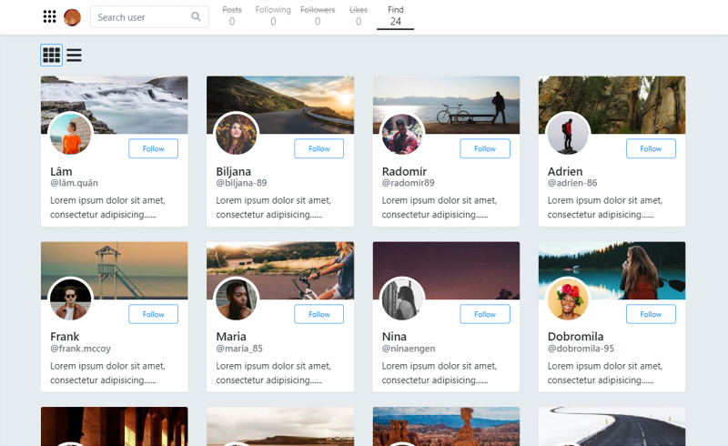

# 簡易社群名單 Vue版



成品Demo - [Github Pages](https://lastor-chen.github.io/sns_userlist_vue)

這是一個 Vue.js 練習專案。<br>
將以前練習的無框架前端作品改裝為 Vue 架構。<br>
([前作連結](https://github.com/Lastor-Chen/sns_user_list))

仿照 Twitter / LinkedIn 等社群平台，將 Users 資源 list 在頁面上。<br>
具有 follow / unfollow，無限下拉分頁等功能。

使用線上課程提供的練習用 User API 進行延伸。<br>
此 API 僅提供「GET 所有User」、「GET 個別User」兩種功能。<br>
所以 follow/unfollow 是利用瀏覽器 Storage 模擬資料庫手刻出來的效果。

<br>

|  branch  |   內容    | 
|----------|----------|
| master   | 專案本體   | 
| gh-pages | build佈署 |

## 功能
- 瀏覽
  - 可使用 Find 功能，尋找 Users，拓展人脈
  - 可使用關鍵字搜尋 User name
  - 點擊 User Card 可於 pop-up viewer 顯示詳細情報
  - 可切換 Card / List，兩種 view mode
- 可以 Follow / Unfollow 其他 User
- 可以檢視 Following Users


## 練習目標

- 練習 Vue 框架
- 頁面元件化拆分
- AJAX API
- build and deploy 

## 使用技術
|      | 項目 | 項目 |    項目     | 項目 |
|------|------|------|------------|---|
| 前端語言 | HTML5 | CSS3 | JavaScript | jQuery |
| 技術概念 | RWD   | MVC | AJAX | |
| 框架套件 | Vue.js  | axios | Bootstrap | |

<br>

|        | API資訊 |
|--------|--------|
| Users data  | Alpha Camp 教學用 API |
| banner images | [Lorem Picusum](https://picsum.photos/) |

## Installation & 本機端啟動

下載專案
```
$ git clone https://github.com/Lastor-Chen/sns_userlist_vue.git
```

安裝 dependencies
```
$ npm install
```

啟動
```
$ npm run serve
```